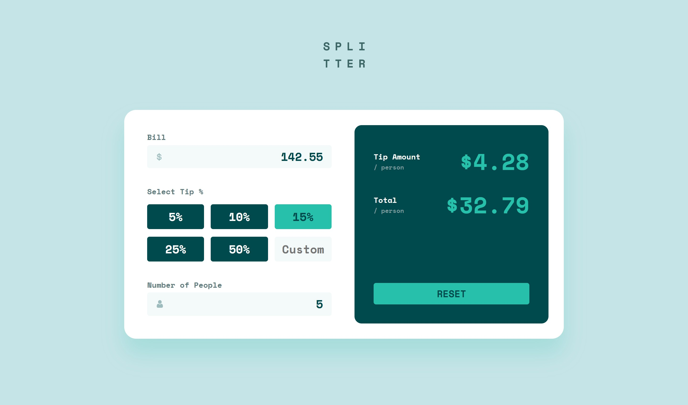

# Frontend Mentor - Tip calculator app solution

This is a solution to the [Tip calculator app challenge on Frontend Mentor](https://www.frontendmentor.io/challenges/tip-calculator-app-ugJNGbJUX).

## Overview

### The challenge

Users should be able to:

- View the optimal layout for the app depending on their device's screen size
- See hover states for all interactive elements on the page
- Calculate the correct tip and total cost of the bill per person

### Screenshot



## My process

### Built with

- Semantic HTML5 markup
- CSS custom properties
- Flexbox
- CSS Grid
- Mobile-first workflow

### What I learned

```js
_tipButtons.forEach((button) =>
  button.addEventListener("click", ({ target }) => {
    document
      .querySelector(".tip-buttons .selected")
      ?.classList.remove("selected");
    target.classList.add("selected");
    setTip(parseFloat(target.textContent) / 100);
  })
);

// Event Delegation
["focus", "input"].forEach((event) =>
  _customTip.addEventListener(event, () => {
    clearButtonSelection();
    setCustomTip();
  })
);
```

## Author

- Frontend Mentor - [@MaxCoder-mc](https://www.frontendmentor.io/profile/MaxCoder-mc)
